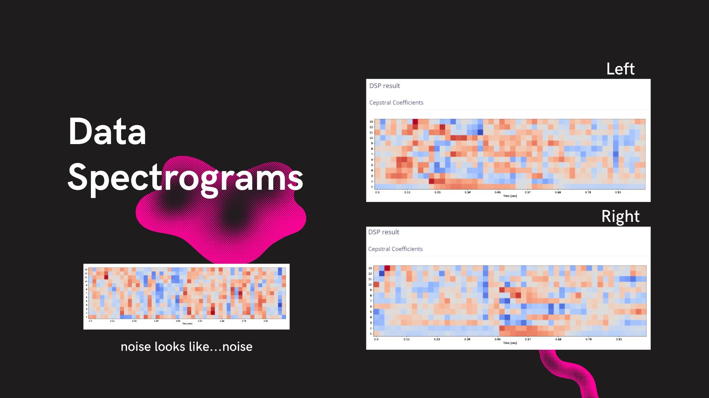
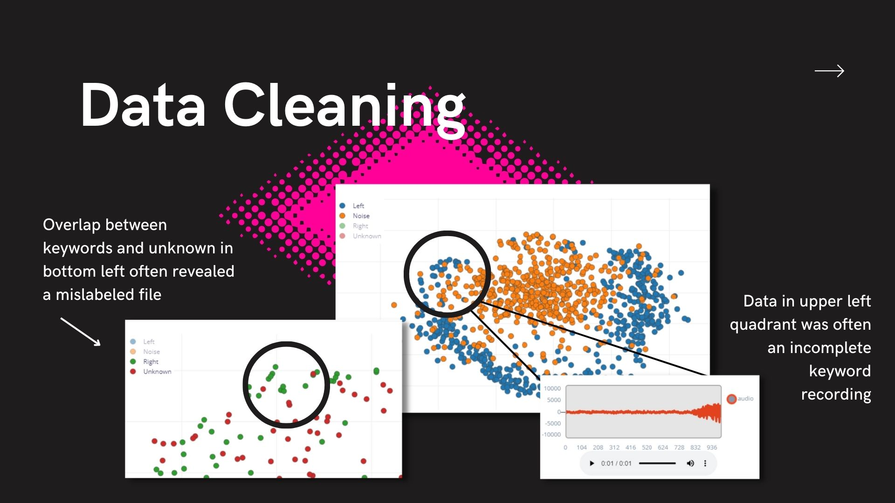
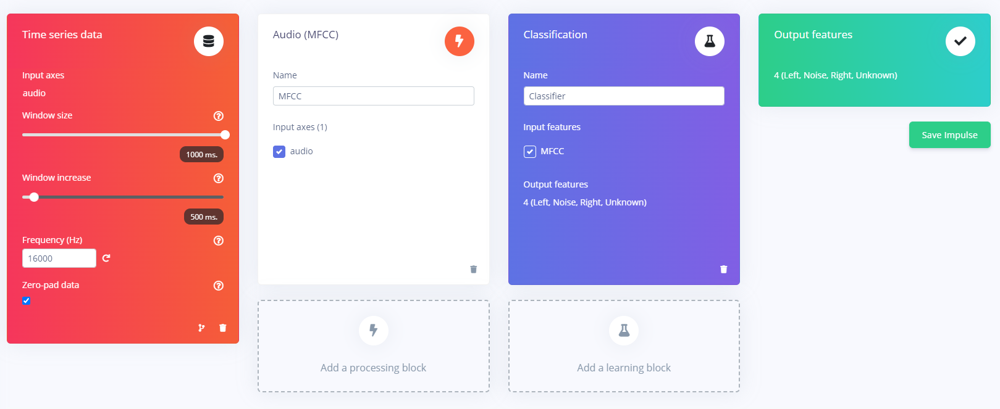
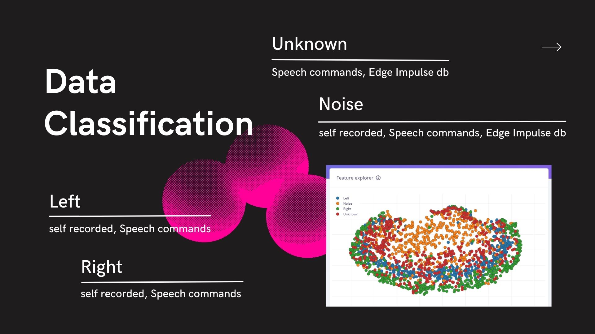
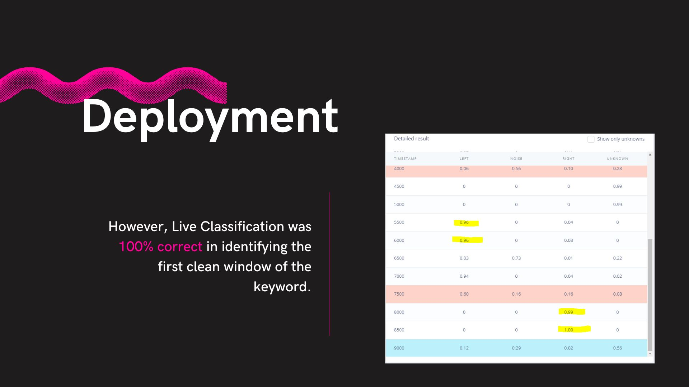
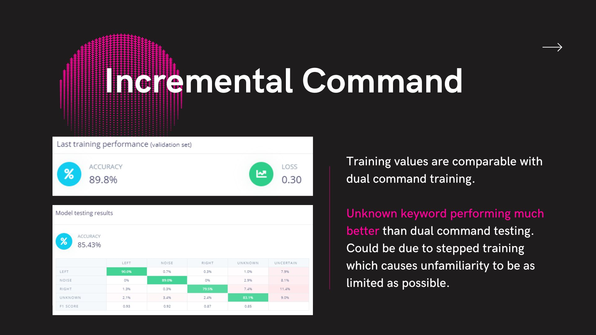
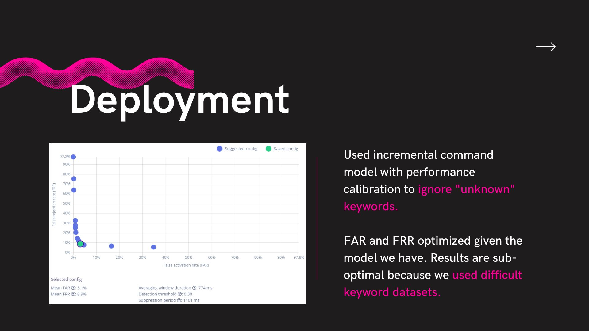
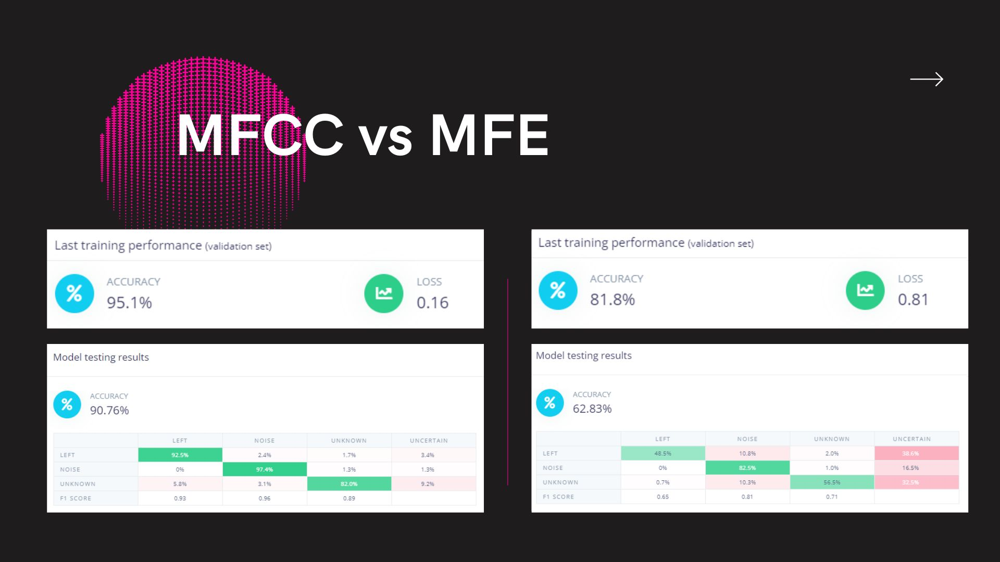

## Introduction
The inspiration for this project came from iterating on [@djdunc's](https://github.com/djdunc) gesture detection
model for driving a smart helmet. In order to reduce the number of false positives and create a hands-free experience for the user, this project used an audio classification model.

This system utilizes Edge Impulse to deploy an audio classification model on an Arduino Nano 33 BLE Sense that drives an embedded LED strip for hands-free signaling using the keywords "left" and "right."

Multiple experiments were run to determine an optimal model trained specifically for outdoor deployment in a noisy environment, with the ability to recognize multiple keywords consistently.

### Edge Impulse Models
- [Single Keyword](https://studio.edgeimpulse.com/studio/198343)
- [Dual Keyword](https://studio.edgeimpulse.com/studio/198602)
- [Incremental Keyword](https://studio.edgeimpulse.com/studio/198643)

## Research Question
This project investigated two questions:

1. Is audio classification detection with a single keyword more accurate than a multi-keyword model?
2. Does incremental training produce a more accurate model overall when using multiple keywords?

## Application Overview
Edge Impulse was the key component for the organization and execution of the project. It enabled easy data ingestion and direct capture using the onboard microphone of the Arduino Nano 33 BLE Sense. 

Image: [https://www.edgeimpulse.com/blog/getting-started-with-edge-impulse](https://www.edgeimpulse.com/blog/getting-started-with-edge-impulse)

This workflow made it possible for continuous iterations with both data training sets and adjustments to the neural network as well. Once the training and testing were complete, Edge Impulse generated a library for the Arduino IDE to deploy onto my selected board easily.

## Data
This project used a combination of sources to build out four data labels: left, right, unknown, and noise. The unknown dataset included randomized single-word keywords that incorporated both numbers and words. The training data included 20 minutes per category, and the final testing data used an additional 5 minutes per category to achieve the recommended 80/20 split.

The first dataset was a series of left and right keyword on-device keyword recordings using the Arduino Nano BLE 33 Sense through Edge Impulse, which saved and stored files directly in the project. Next, that was augmented with the Speech Commands library [1], which provided 20 minutes of data for left, right, unknown, and noise keywords. Additional noise files were pulled from Edge Impulse’s Keywords database [2].

The most time-consuming portion of the project was cleaning the data to remove any
bad samples and fix incorrect labeling from the imported datasets. The Speech
Commands library contained a wide range of accents, ages, and recording quality,
which led to some overlapping within the data separation feature explorer.

Edge Impulse provided further data augmentation options, bolstering the datasets with
additional noise, time banding, and frequency bands.

## Model
A time series model was used for this project, with one audio input axis and a window
size of 1000ms. The frequency was set to 16000 Hz, optimized to detect spoken
keywords.

Both audio processing blocks were used at different points in the project. The Mel
Frequency Cepstral Coefficient (MFCC) was the primary block since it is specifically
calibrated to detect human voices. The Mel-filterbank energy (MFE) model was used in
comparison, as it is more efficient with non-voice audio and detecting multiple
frequencies.
The Classification (Keras) block was used to learn the spectrometer patterns for each
keyword in the model, which was necessary in order to accurately differentiate between
the model keywords and “unknown” classification.

## Experiments
Four separate experiments were run to address the research questions for this project.

| Name                | Description                                                                                                                  | Keywords                    | Results                                                        |
|---------------------|------------------------------------------------------------------------------------------------------------------------------|-----------------------------|----------------------------------------------------------------|
| Single Command      | Only used one keyword to see how well it could be distinguished from unknown keywords and noise                              | Left, Noise, Unknown        | Training performance: 95% Testing performance: 91%             |
| Dual Command        | Used both left and right keywords. Trained the model outright seeing how introducing an additional keyword affected accuracy | Left, Right, Noise, Unknown | Training performance: 91% Testing performance: 84%             |
| Incremental Command | Used left and right keywords. Trained model with left keyword first then retrained by introducing right keyword              | Left, Right, Noise, Unknown | Training performance: 90% Testing performance: 85%             |
| MFCC vs MFE         | Compared two audio classifier models using one keyword                                                                       | Left, Noise, Unknown        | MFCC Testing: 95% Training: 91% MFE Testing: 82% Training: 63% |

## Results and Observations
The most difficult part of this project was sourcing a large enough dataset to train a
multi-keyword model that could accurately run in a noisy, outdoor setting. Initial training
of the model was deeply affected by incorrectly labeled samples, and cleaning the
datasets after import proved very time-consuming. Because the final training and testing
datasets were so large, it was impossible to correct all files, which brought the final
training and testing accuracy percentages down. However, when the model was tested
live on the Arduino Nano 33 BLE Sense, it had a 100% accuracy rating.

Recognizing speech over noise requires a minimum of three keywords instead of two:
the keyword itself, an unknown category of related or unrelated words, and different
examples of environmental noise. Overall, the model could recognize the “left” keyword
much more accurately than the “right.” This could be due to the data cleaning issue or
because the “left” keyword was often much shorter than the “right” keyword, allowing
fewer windows to be used to detect.

Based on the experiments that were run, having multiple keywords affected the
accuracy of the model only slightly, and incremental training had the best testing
outcome of 85% accuracy. Additional performance calibration was added to the
deployed model that focused on reducing false positives and ignoring “unknown”
keywords.

The final experiment of comparing the two audio classification models clearly
demonstrated the preference for the MFCC model when working with the human voice.

Because the training dataset was purposefully difficult, with a large variety of accents,
dialects, and background noise in the recordings, the live performance of the model was
significantly more accurate than the percentages shown during training. This level of
training is ideal for a product that would hopefully be accessible to any English speaker
regardless of sex, age, or ethnicity. A final recommendation would be to require users of
the smart helmet to record keyword samples of their own during product setup and
initialization to add one last layer of optimization on top of the built model.

## Bibliography

1. Comparison MFCC versus MFE to recognize doorbell ring (2020) Edge Impulse.
Available at:
https://forum.edgeimpulse.com/t/comparison-mfcc-versus-mfe-to-recognize-door
bell-ring/765/4 (Accessed: 23 March 2023).
2. ‘Introduction to Machine Learning with Edge Impulse’ (no date) Machine Learning
[Preprint]. Simple audio recognition: Recognizing keywords | TensorFlow Core
(no date) TensorFlow. Available at:
https://www.tensorflow.org/tutorials/audio/simple_audio (Accessed: 23 March
2023).
3. TinyML Made Easy: Sound Classification (KWS) - Hackster.io (no date).
Available at:
https://www.hackster.io/mjrobot/tinyml-made-easy-sound-classification-kws-2fb3a
b (Accessed: 23 March 2023).
4. tinyML Summit 2021 tiny Talks: Environmental Noise Classification on
Microcontrollers (2021). Available at:
https://www.youtube.com/watch?v=cARhrotq5HA (Accessed: 23 March 2023).
5. Warden, P. (2018) ‘Speech Commands: A Dataset for Limited-Vocabulary
Speech Recognition’. arXiv. Available at: http://arxiv.org/abs/1804.03209
(Accessed: 21 March 2023).

----

## Declaration of Authorship

I, Haiden McGill, confirm that the work presented in this assessment is my own. Where information has been derived from other sources, I confirm that this has been indicated in the work.

Haiden McGill

24 April 2023
