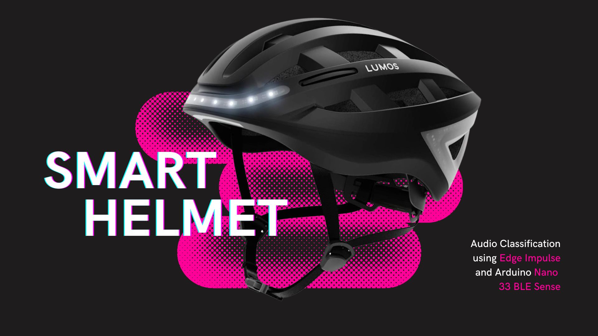

## Introduction
The inspiration for this project came from iterating on @djdunc's gesture detection model for driving a smart helmet. The decision to switch the detection model to audio classification was done in order to get a more consistent result that limited the amount of false positives, and made the experience safer and completely "hands free" for the user.

This system utilizes Edge Impulse to deploy an audio classification model on an Arduino Nano 33 BLE Sense that drives an embedded LED strip in the helmet for hands free turn signalling. 

Muliple experiments were run in order to determine an optimal model trained specifically for outdoor deployment in a noisy environment, with the ability to consistently recognize multiple keywords.

### Edge Impulse Models
- [Single Keyword](https://studio.edgeimpulse.com/studio/198343)
- [Dual Keyword](https://studio.edgeimpulse.com/studio/198602)
- [Incremental Keyword](https://studio.edgeimpulse.com/studio/198643)

## Research Question
What is the problem you are trying to solve

*Tip: probably 1 or 2 sentences*

## Application Overview
Thinking back to the various application diagrams you have seen through the module - how would you describe an overview of the building blocks of your project - how do they connect, what do the component parts include.

*Tip: probably ~200 words and a diagram is usually good to convey your design!*

## Data
Describe what data sources you have used and any cleaning, wrangling or organising you have done. Including some examples of the data helps others understand what you have been working with.

*Tip: probably ~200 words and images of what the data 'looks like' are good!*

## Model
This is a Deep Learning project! What model architecture did you use? Did you try different ones? Why did you choose the ones you did?

*Tip: probably ~200 words and a diagram is usually good to describe your model!*

## Experiments
What experiments did you run to test your project? What parameters did you change? How did you measure performance? Did you write any scripts to evaluate performance? Did you use any tools to evaluate performance? Do you have graphs of results? 

*Tip: probably ~300 words and graphs and tables are usually good to convey your results!*

## Results and Observations
Synthesis the main results and observations you made from building the project. Did it work perfectly? Why not? What worked and what didn't? Why? What would you do next if you had more time?  

*Tip: probably ~300 words and remember images and diagrams bring results to life!*

## Bibliography
*If you added any references then add them in here using this format:*

1. Last name, First initial. (Year published). Title. Edition. (Only include the edition if it is not the first edition) City published: Publisher, Page(s). http://google.com

2. Last name, First initial. (Year published). Title. Edition. (Only include the edition if it is not the first edition) City published: Publisher, Page(s). http://google.com

*Tip: we use [https://www.citethisforme.com](https://www.citethisforme.com) to make this task even easier.* 

----

## Declaration of Authorship

I, AUTHORS NAME HERE, confirm that the work presented in this assessment is my own. Where information has been derived from other sources, I confirm that this has been indicated in the work.

*Digitally Sign by typing your name here*

ASSESSMENT DATE
