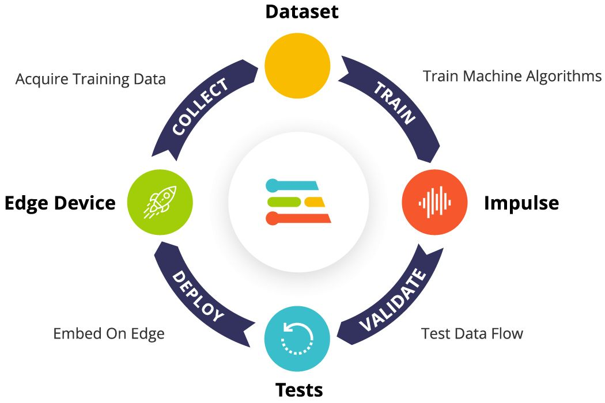

## Introduction
The inspiration for this project came from iterating on [@djdunc's](https://github.com/djdunc) gesture detection
model for driving a smart helmet. In order to reduce the number of false positives and create a hands-free experience for the user, this project used an audio classification model.

This system utilizes Edge Impulse to deploy an audio classification model on an Arduino Nano 33 BLE Sense that drives an embedded LED strip for hands-free signaling using the keywords "left" and "right."

Multiple experiments were run to determine an optimal model trained specifically for outdoor deployment in a noisy environment, with the ability to recognize multiple keywords consistently.

### Edge Impulse Models
- [Single Keyword](https://studio.edgeimpulse.com/studio/198343)
- [Dual Keyword](https://studio.edgeimpulse.com/studio/198602)
- [Incremental Keyword](https://studio.edgeimpulse.com/studio/198643)

## Research Question
This project investigated two questions:

1. Is audio classification detection with a single keyword more accurate than a multi-keyword model?
2. Does incremental training produce a more accurate model overall when using multiple keywords?

## Application Overview
Edge Impulse was the key component for the organization and execution of the project. It enabled easy data ingestion and direct capture using the onboard microphone of the Arduino Nano 33 BLE Sense. 

Image: [https://www.edgeimpulse.com/blog/getting-started-with-edge-impulse](https://www.edgeimpulse.com/blog/getting-started-with-edge-impulse)

This workflow made it possible for continuous iterations with both data training sets and adjustments to the neural network as well. Once the training and testing were complete, Edge Impulse generated a library for the Arduino IDE to deploy onto my selected board easily.

## Data
This project used a combination of sources to build out four data labels: left, right, unknown, and noise. The unknown dataset included randomized single-word keywords that incorporated both numbers and words. The training data included 20 minutes per category, and the final testing data used an additional 5 minutes per category to achieve the recommended 80/20 split.

The first dataset was a series of left and right keyword on-device keyword recordings using the Arduino Nano BLE 33 Sense through Edge Impulse, which saved and stored files directly in the project. Next, that was augmented with the Speech Commands library [1], which provided 20 minutes of data for left, right, unknown, and noise keywords. Additional noise files were pulled from Edge Impulse’s Keywords database [2].

The most time-consuming portion of the project was cleaning the data to remove any
bad samples and fix incorrect labeling from the imported datasets. The Speech
Commands library contained a wide range of accents, ages, and recording quality,
which led to some overlapping within the data separation feature explorer.

Edge Impulse provided further data augmentation options, bolstering the datasets with
additional noise, time banding, and frequency bands.

## Model
A time series model was used for this project, with one audio input axis and a window
size of 1000ms. The frequency was set to 16000 Hz, optimized to detect spoken
keywords.

Both audio processing blocks were used at different points in the project. The Mel
Frequency Cepstral Coefficient (MFCC) was the primary block since it is specifically
calibrated to detect human voices. The Mel-filterbank energy (MFE) model was used in
comparison, as it is more efficient with non-voice audio and detecting multiple
frequencies.
The Classification (Keras) block was used to learn the spectrometer patterns for each
keyword in the model, which was necessary in order to accurately differentiate between
the model keywords and “unknown” classification.

## Experiments
Four separate experiments were run to address the research questions for this project.

| Name                | Description                                                                                                                  | Keywords                    | Results                                                        |
|---------------------|------------------------------------------------------------------------------------------------------------------------------|-----------------------------|----------------------------------------------------------------|
| Single Command      | Only used one keyword to see how well it could be distinguished from unknown keywords and noise                              | Left, Noise, Unknown        | Training performance: 95% Testing performance: 91%             |
| Dual Command        | Used both left and right keywords. Trained the model outright seeing how introducing an additional keyword affected accuracy | Left, Right, Noise, Unknown | Training performance: 91% Testing performance: 84%             |
| Incremental Command | Used left and right keywords. Trained model with left keyword first then retrained by introducing right keyword              | Left, Right, Noise, Unknown | Training performance: 90% Testing performance: 85%             |
| MFCC vs MFE         | Compared two audio classifier models using one keyword                                                                       | Left, Noise, Unknown        | MFCC Testing: 95% Training: 91% MFE Testing: 82% Training: 63% |

## Results and Observations
Synthesis the main results and observations you made from building the project. Did it work perfectly? Why not? What worked and what didn't? Why? What would you do next if you had more time?  

*Tip: probably ~300 words and remember images and diagrams bring results to life!*

## Bibliography
*If you added any references then add them in here using this format:*

1. Last name, First initial. (Year published). Title. Edition. (Only include the edition if it is not the first edition) City published: Publisher, Page(s). http://google.com

2. Last name, First initial. (Year published). Title. Edition. (Only include the edition if it is not the first edition) City published: Publisher, Page(s). http://google.com

*Tip: we use [https://www.citethisforme.com](https://www.citethisforme.com) to make this task even easier.* 

----

## Declaration of Authorship

I, Haiden McGill, confirm that the work presented in this assessment is my own. Where information has been derived from other sources, I confirm that this has been indicated in the work.

Haiden McGill

24 April 2023
